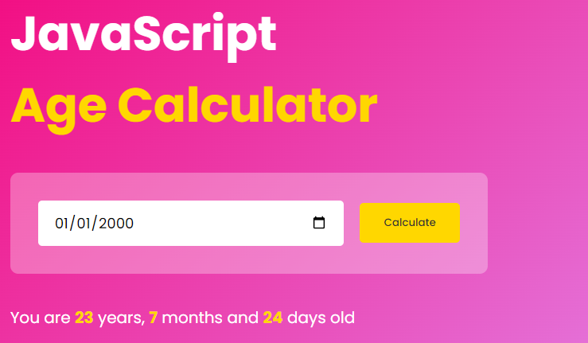

# Age Calculator App



## Table of Contents

- [Description](#description)
- [Features](#features)
- [Demo](#demo)
- [Installation](#installation)
- [Usage](#usage)
- [Contributing](#contributing)
- [License](#license)

## Description

The Age Calculator App is a simple web application that allows users to calculate their age based on their birthdate. It's built using HTML, CSS, and JavaScript, making it easy to use in any web browser without the need for installation.

## Features

- **Age Calculation:** Enter your birthdate, and the app will instantly calculate your current age in years, months, and days.

- **User-Friendly Interface:** The app features a clean and intuitive user interface, making it easy for users of all ages to calculate their age effortlessly.

- **Responsive Design:** The app is designed to work seamlessly on various devices, including desktops, tablets, and mobile phones.

## Demo

You can try out the Age Calculator App by visiting the live demo [here](https://age-calculator-ngww.vercel.app).

## Installation

To run the Age Calculator App locally, follow these steps:

1. Clone the repository to your local machine:

   ```
   git clone https://github.com/ngww/age-calculator-app.git
   ```

2. Navigate to the project directory:

   ```
   cd age-calculator-app
   ```

3. Open the `index.html` file in your preferred web browser.

That's it! You now have the Age Calculator App up and running on your local machine.

## Usage

1. Open the app in your web browser.

2. Enter your birthdate in the provided input field.

3. Click the "Calculate Age" button.

4. The app will display your current age in years, months, and days.

5. To calculate the age again, simply enter a different birthdate and click the button.

## Contributing

Contributions are welcome! If you'd like to contribute to this project, please follow these guidelines:

1. Fork the repository.

2. Create a new branch for your feature or bug fix:

   ```
   git checkout -b feature-name
   ```

3. Make your changes and commit them with descriptive commit messages.

4. Push your changes to your fork:

   ```
   git push origin feature-name
   ```

5. Create a pull request to merge your changes into the main branch.

## License

This project is licensed under the MIT License - see the [LICENSE](LICENSE) file for details.

---

Feel free to customize this README to include specific details about your app, such as installation prerequisites or additional features. Providing clear and concise instructions will help users and potential contributors understand and use your Age Calculator App.